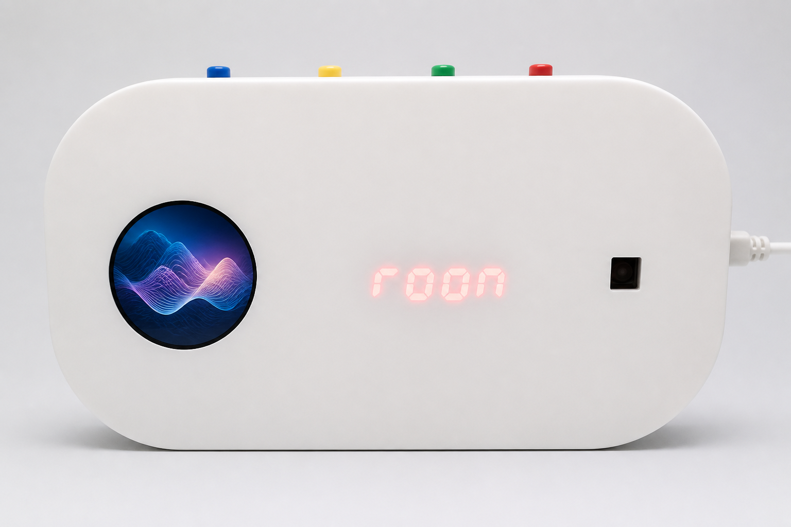
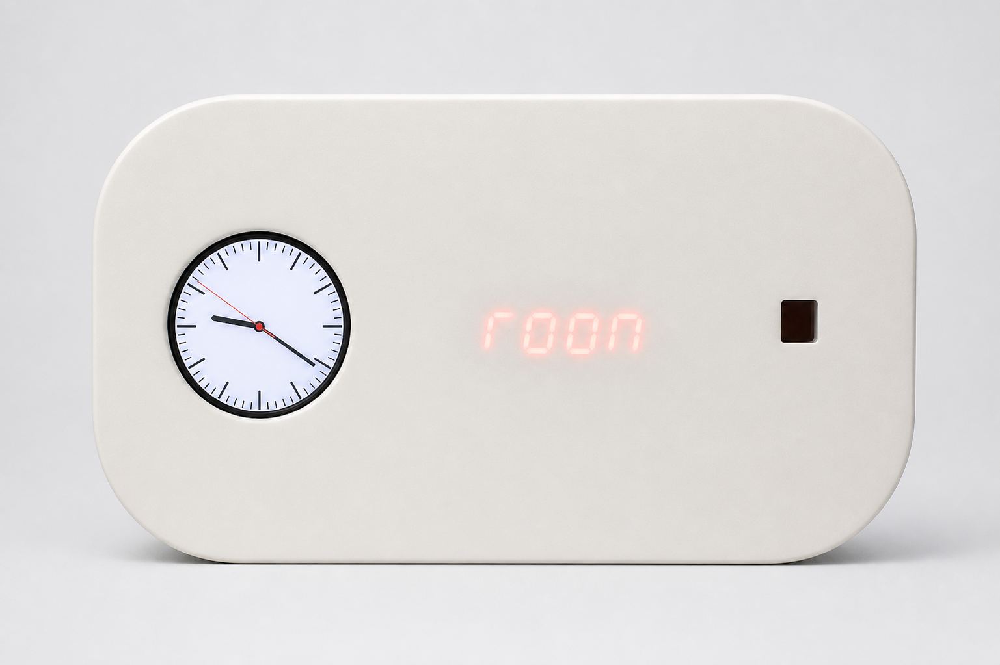
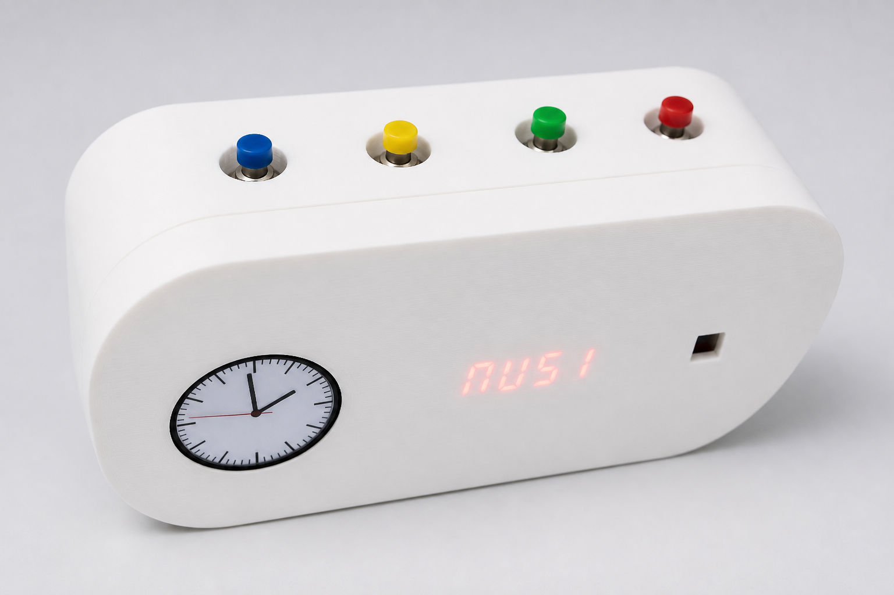
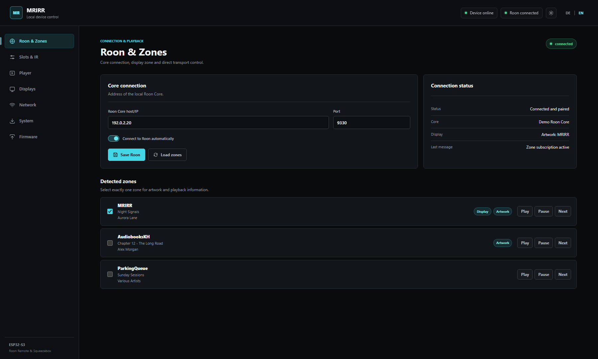
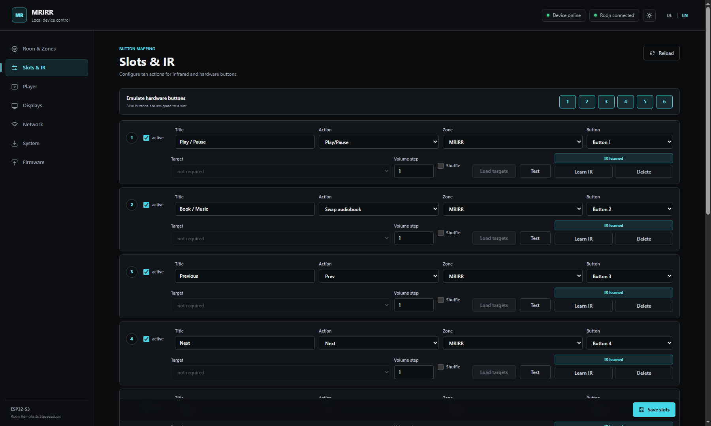
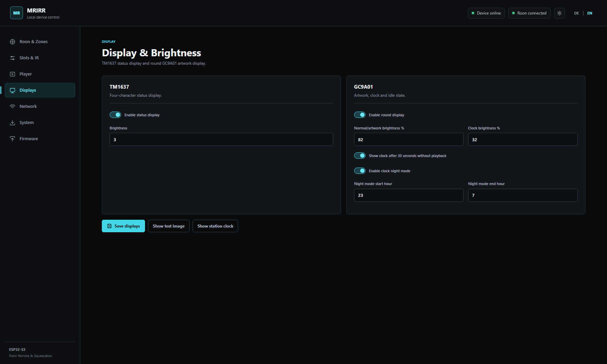
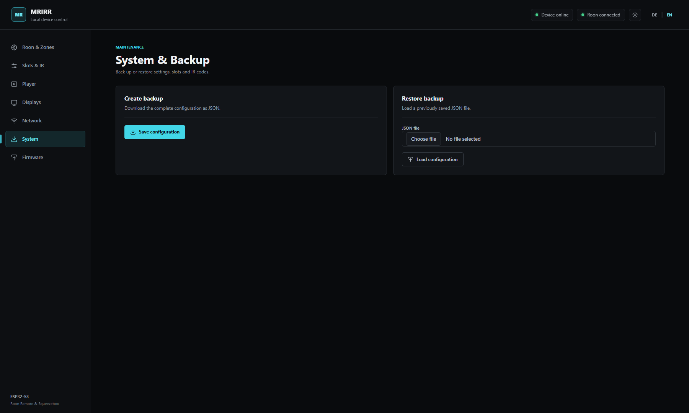

# MRIRR

### Minimal Roon IR Remote

**A tactile Roon controller, learned IR remote and Squeezebox audio endpoint in one compact ESP32-S3 device.**

<p align="center">
  
</p>

MRIRR combines physical buttons, an infrared remote, local Roon control,
Squeezebox playback and two displays. It is designed for everyday listening,
with dedicated workflows for music, radio, playlists and long-form audiobooks.

The device communicates directly with services on the local network. Normal
operation does not require a cloud account, phone app or companion process.

> [!IMPORTANT]
> **Roon authorization is required after the first installation.** Open
> **Roon > Settings > Extensions**, find the extension with creator
> **Senior Coder** and name **Minimal Roon IR Remote**, then select
> **Enable**. MRIRR cannot load zones or control Roon until this extension has
> been authorized.

> This private repository is the distribution and documentation area for
> MRIRR. Firmware source code is intentionally not included.

## First-time setup

1. Install the MRIRR Factory firmware and restart the device.
2. Connect MRIRR to the local Wi-Fi network through its setup page.
3. Open **Settings > Extensions** in Roon.
4. Locate **Minimal Roon IR Remote** by **Senior Coder** and select
   **Enable**.
5. Open the MRIRR web interface, enter the Roon Core address when required,
   and load the available zones.

The authorization is stored by Roon and normally only has to be granted once.
If MRIRR reports that Roon is waiting for approval, return to the Extensions
page and confirm that this entry is enabled:

| Roon extension field | Required value |
| --- | --- |
| Creator | `Senior Coder` |
| Name | `Minimal Roon IR Remote` |

## What MRIRR does

### Direct Roon control

MRIRR discovers and controls Roon zones over the local network. The web
interface shows live zone state, title and artist information and provides
transport tests. One detected zone can be selected as the source for the
device displays.

### Squeezebox audio endpoint

The ESP32-S3 also appears to Roon as a Squeezebox-compatible playback device.
Audio is sent over I2S to a PCM5102 DAC. The current configuration deliberately
uses a 44.1 kHz output target so Roon performs any required resampling before
the stream reaches the device.

### Ten programmable slots

Ten independent slots connect a physical or learned IR button with an action.
Available actions include:

- play, pause and play/pause toggle
- previous and next
- volume up and volume down with a configurable step size
- live radio and playlist playback
- optional shuffle for playlists
- audiobook transfer and audiobook/music queue swap

Each slot can target a specific Roon zone. Configured buttons can also be
tested directly from the browser.

### Buttons and learned IR commands

Up to six enclosure buttons are read through a PCF8574T I/O expander using its
interrupt line with guarded polling as a fallback. All ten slots can also
learn and recognise infrared commands, allowing an existing remote control to
operate MRIRR without changing its original layout.

### Audiobook handoff

MRIRR includes a queue workflow made for switching between loudspeaker and
headphone listening without losing the audiobook position:

| Zone | Purpose |
| --- | --- |
| `MRIRR` | Active playback zone |
| `AudiobooksKH` | Current audiobook queue and listening position |
| `ParkingQueue` | Temporarily parked music queue |

In book mode, pausing can update `AudiobooksKH` with the current queue and
position. A later play command restores that state before playback resumes.
The swap action parks music in `ParkingQueue`, moves the audiobook to `MRIRR`
and reverses that transfer when returning to music. The four-digit display
keeps the active `BUCH` or `MUSI` state visible.

### Artwork, clock and status displays

The round GC9A01 display shows artwork obtained from Roon while the selected
display zone is playing. When playback has been inactive for 30 seconds, it
returns to the station clock or switches off, depending on the saved setting.
It also provides boot and version feedback.

The TM1637 display gives persistent, glanceable status feedback such as the
book/music mode and Roon volume values. Day and night brightness can be
configured locally.

<table>
  <tr>
    <td width="50%"></td>
    <td width="50%"></td>
  </tr>
  <tr>
    <td align="center"><strong>Station clock</strong></td>
    <td align="center"><strong>Tactile controls and persistent status</strong></td>
  </tr>
</table>

## Local web configuration

The responsive configuration interface is served by MRIRR itself. It supports
German and English, includes dark and light themes and does not depend on an
internet connection. Configuration can be exported as JSON and restored later;
after a restore, the interface clearly requests the required reboot instead of
restarting the device unexpectedly.

All screenshots below were rendered from the real MRIRR web interface with
fictional demonstration data. They contain no private network information or
Roon credentials.

### Roon and zones

Select the display zone, inspect live metadata and test zone transport
commands.



### Slots and infrared control

Configure the ten action slots, assign physical buttons, learn IR commands and
test each mapping from the browser.



### Displays

Configure the round artwork display, idle behaviour, station clock and
brightness levels.



### Backup and restore

Download the complete configuration or restore it from a previously exported
JSON file.



## Hardware

The reference assembly uses the following components:

| Component | Function |
| --- | --- |
| ESP32-S3 WROOM-1 N16R8 | Controller, Wi-Fi, 16 MB flash and 8 MB PSRAM |
| PCM5102 | Stereo I2S DAC |
| GC9A01, 240 x 240 | Round colour artwork and clock display |
| TM1637, four digit | Persistent status display |
| PCF8574T | Button input expansion |
| IR receiver | Learned remote-control input |
| Enclosure buttons | Up to six direct slot inputs; the pictured prototype uses four |

All connected modules in the reference build operate at 3.3 V. See
[hardware and wiring](hardware/README.md) for the complete pin assignment,
power notes and the English wiring diagram.

## System overview

```text
Roon Core
   |-- local Roon control and metadata --> MRIRR web UI, slots and displays
   |-- Squeezebox audio stream ----------> ESP32-S3 --> I2S --> PCM5102

Buttons --> PCF8574T --|
IR receiver -----------|--> slot actions --> selected Roon zone
```

## Installation and firmware

This repository is prepared to provide:

- browser-based first installation and USB recovery
- compiled Factory and OTA images through GitHub Releases
- checksums and bilingual release notes
- hardware documentation and wiring diagrams
- signed internet updates after the update path has been fully tested

The browser installer is intended for current desktop versions of Chrome and
Edge on Windows, macOS and Linux. It remains locked until a release image has
passed the privacy and recovery checks. See
[firmware files and releases](firmware/README.md) for the planned package
layout.

GitHub Pages cannot currently be enabled for this private repository on the
active account plan. The prepared installer can later be published from the
`docs` directory or moved to a separate approved public installer repository.

## Privacy and security

Published files must never contain Wi-Fi credentials, Roon tokens, device
backups, private signing keys or other personal information. The private
firmware signing key is never stored on GitHub.

## Project status

MRIRR is currently in private hardware testing. The core Roon control,
Squeezebox playback, physical and IR inputs, queue workflows, displays and
configuration backup have been exercised on the reference device. No public
Factory firmware has been approved yet.

MRIRR is an independent project and is not affiliated with or endorsed by
Roon Labs. Roon is a trademark of Roon Labs.
