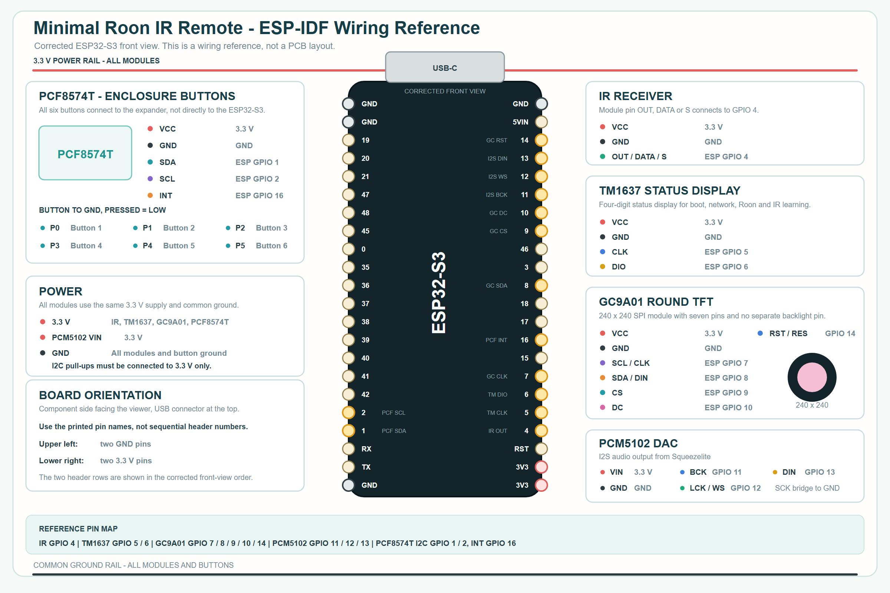

# Hardware and wiring

The current reference device uses an ESP32-S3 WROOM-1 N16R8 development board
with 16 MB flash and 8 MB PSRAM.

The editable vector version is available as
[mrirr-wiring.svg](mrirr-wiring.svg).

## Pin assignment

| Function | ESP32-S3 pin | Module pin |
| --- | ---: | --- |
| PCF8574T SDA | GPIO 1 | SDA |
| PCF8574T SCL | GPIO 2 | SCL |
| IR receiver | GPIO 4 | OUT / DATA / S |
| TM1637 clock | GPIO 5 | CLK |
| TM1637 data | GPIO 6 | DIO |
| GC9A01 clock | GPIO 7 | SCL / CLK |
| GC9A01 data | GPIO 8 | SDA / DIN |
| GC9A01 chip select | GPIO 9 | CS |
| GC9A01 data/command | GPIO 10 | DC |
| PCM5102 bit clock | GPIO 11 | BCK / BCLK |
| PCM5102 word select | GPIO 12 | LCK / WS |
| PCM5102 audio data | GPIO 13 | DIN |
| GC9A01 reset | GPIO 14 | RST / RES |
| PCF8574T interrupt | GPIO 16 | INT |

## Power

The documented reference assembly operates all connected modules from 3.3 V.
All modules must share a common ground. I2C pull-up resistors must be connected
to 3.3 V and never to 5 V.

## PCF8574T buttons

`A0`, `A1` and `A2` are connected to ground, selecting address `0x20`. Buttons
1 through 6 connect `P0` through `P5` to ground. `INT` is connected to GPIO 16.

## PCM5102 jumpers

| Jumper | Position |
| --- | --- |
| H1 / FLT | LOW |
| H2 / DEMP | LOW |
| H3 / XSMT | HIGH |
| H4 / FMT | LOW |

The separate SCK solder bridge is connected to ground. SCK is not connected to
an ESP32 GPIO.

All pin names refer to GPIO numbers. They do not refer to a board vendor's
sequential header numbering or `D` aliases.
